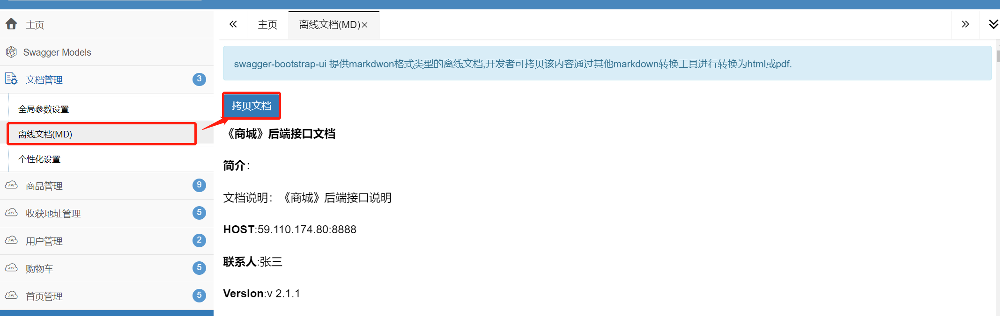
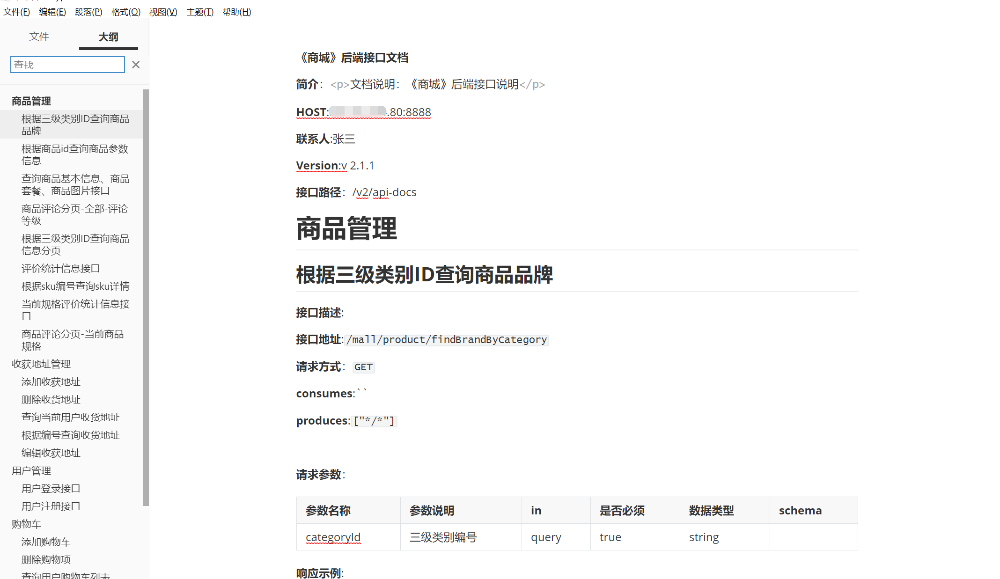
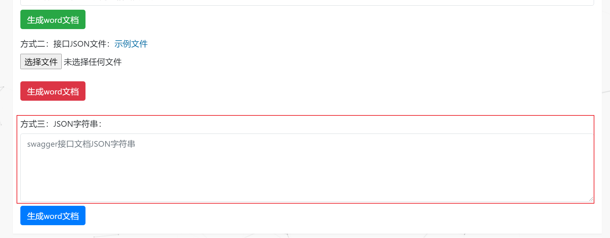
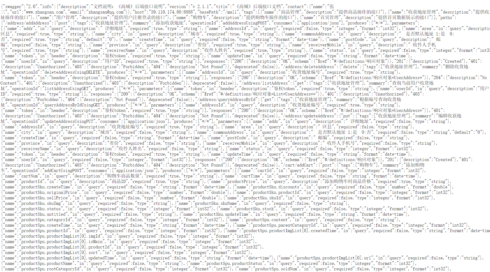
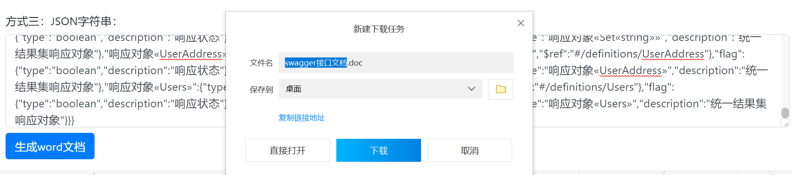

# Swagger技术

>  前后端分离开发，后端需要编写接口说明文档，会耗费比较多的时间
>
>  Swagger是一款RESTFUL接口的文档在线自动生成+功能测试功能软件;是一个规范和完整的框架，用于生成、描述、调用和可视化RESTful风格的Web服务;目标是使客户端和文件系统作为服务器以同样的速度来更新文件的方法，参数和模型紧密集成到服务器
>
>  - 对代码侵入性低，采用全注解的方式，开发简单
>  - 方法参数名修改、增加、减少参数都可以直接生效，不用手动维护
>  - 不需要对业务代码进行修改  
>  - 不需要自己拼接参数  
>  - 缺点：增加了开发成本，写接口还得再写一套参数配置

##  作用

-  生成接口说明文档
-  对接口进行测试 

##  Swagger整合 

- 在springboot工程添加依赖（springfox-swagger2 \ springfox-swagger-ui） 

  ```xml
  <dependency>
      <groupId>io.springfox</groupId>
      <artifactId>springfox-swagger2</artifactId>
      <version>2.9.2</version>
  </dependency>
  <dependency>
      <groupId>io.springfox</groupId>
      <artifactId>springfox-swagger-ui</artifactId>
      <version>2.9.2</version>
  </dependency>
  ```

- 在springboot工程中创建swagger的配置（Java配置方式） 

  ```java
  @Configuration
  @EnableSwagger2 //启动swagger的自动配置
  public class Swagger2Config {
      /*  swagger会帮助我们生成接口文档
       * 1：配置生成的文档信息:比如文档名称、作者、版本..
       * 2: 配置生成规则
       * */
  
      /*Docket封装接口文档信息*/
      @Bean
      public Docket getDocket() {
          //创建封面信息对象
          ApiInfoBuilder apiInfoBuilder = new ApiInfoBuilder();
          apiInfoBuilder.title("《商城》后端接口说明") //文档标题
                  .description("文档说明：《商城》后端接口文档，哈哈哈哈") //文档说明
                  .version("v 2.1.1") //版本
                  .contact(new Contact("张三", "www.zhangsan.com", "zhangsan@qq.com"));//作者
          ApiInfo apiInfo = apiInfoBuilder.build();
          //DocumentationType.SWAGGER_2:指定文档风格
          Docket docket = new Docket(DocumentationType.SWAGGER_2)
                  .apiInfo(apiInfo) //指定生成的文档中的封面信息：文档标题、版本、作者
                  .select()
              .apis(RequestHandlerSelectors.basePackage("com.wudagai.neumall.controller")) //为指定包的处理器方法生成接口文档
                  //.paths(PathSelectors.regex("/user/"))//指定com.wudagai.neumall.controller中/user/的路径
                  .paths(PathSelectors.any()) //指定com.wudagai.neumall.controller中所有的路径
                  .build();
          return docket;
      }
  }
  
  ```

- 测试 

  - 启动SpringBoot应用，访问： http://localhost:8080/swagger-ui.html 

##  Swagger注解说明 

>  swagger提供了一套注解，可以对每个接口进行详细说明 

-    创建一个实体类用于测试

  ```java
  @Data
  public class Users {
      private Integer userId;
      private String userName;
      private String password;
      private Integer age;
      @JsonFormat(pattern="yyyy-MM-dd HH:mm:ss",timezone="GMT+8")
      private Date birthday;
      private String sex;
      private Integer money;
  }
  ```

  

- 常用注解一：`@Api` 类注解，在控制器类添加此注解，可以对控制器类进行功能说明

  ```kava
  @Api(description = "提供用户登录注册接口",tags = "用户管理")
  ```

- 常用注解二：` @ApiOperation` 方法注解：说明接口方法的作用 

- `@ApiImplicitParams` 和 `@ApiImplicitParam` 方法注解，说明接口方法的参数 

  ```java
  @ApiOperation("用户登录接口")
  @ApiImplicitParams({
          @ApiImplicitParam(dataType = "string",name = "username", value = "用户登录账号",required =true),
          @ApiImplicitParam(dataType = "string",name = "password", value = "用户登录密码",required =true)
  })
  @RequestMapping("/userLogin")
  public Users userLogin(String username, String password){
      Users users=new Users();
      return users;
  }
  ```

- 常用注解三`@ApiModel` 和 `@ApiModelProperty` 当接口参数和返回值为对象类型时，在实体类中添加注解说明 

  > @ApiModel：
  >
  > **value**属性就是对所需要特别说明的接口相关实体类进行描述。如果不用value时，默认值就是实体类的名称，所以除非有特殊说明或者实体类不清晰，否则直接使用默认值即可。
  >
  > **description**属性就是对所需要特别说明的接口相关实体类进行较长的描述。如果想对用户实体添加必要的描述信息，可以如下所示： 
  >
  > @ApiModelProperty：用于字段 ，表示对model属性的说明  

  ```java
  @Data
  @ApiModel(value = "用户对象",description = "用户/买家信息")
  public class Users {
      @ApiModelProperty(dataType = "int",value = "用户编号")
      private Integer userId;
  
      @ApiModelProperty(dataType = "string",value = "用户名")
      private String userName;
  
      @ApiModelProperty(dataType = "string",value = "密码")
      private String password;
  
      @ApiModelProperty(dataType = "int",value = "年龄")
    private Integer age;
  
      @ApiModelProperty(dataType = "string",value = "生日 yyyy-MM-dd HH:mm:ss")
      @JsonFormat(pattern="yyyy-MM-dd HH:mm:ss",timezone="GMT+8")
      private Date birthday;
  
      @ApiModelProperty(dataType = "string",value = "性别")
      private String sex;
  
      @ApiModelProperty(dataType = "int",value = "用户余额")
      private Integer money;
  }
  ```
  
  - 如果出现以下错误提示
  
    ```
    Illegal DefaultValue null for parameter type integer`和`NumberFormatException: For input string: ""
    ```
  
    - 原因：有个默认值是空字符串的变量转换成Integer类型时异常。也就是说如果实体属性类型是Integer，就把 example 转为 Long 类型，而example默认为 " " ,导致转换错误
  
    - 解决：新增配置，如下
  
      ```xml
      增加两个配置
      <dependency>
          <groupId>io.swagger</groupId>
        <artifactId>swagger-annotations</artifactId>
          <version>1.5.22</version>
    </dependency>
      <dependency>
          <groupId>io.swagger</groupId>
          <artifactId>swagger-models</artifactId>
        <version>1.5.22</version>
      </dependency>
    ```
  
- 常用注解四`@ApiIgnore` 接口方法注解，添加此注解的方法将不会生成到接口文档中 

##  Swagger-ui 插件 

> Swagger-ui 是一套 HTML/CSS/JS 插件，用于渲染 Swagger 文档，以便提供美观的 API 文档界面。
>
> 也就是说，Swagger-ui 是一个 UI 渲染工具。

- 在springboot工程添加依赖

  ```xml
  <dependency>
      <groupId>com.github.xiaoymin</groupId>
      <artifactId>swagger-bootstrap-ui</artifactId>
      <version>1.9.6</version>
  </dependency>
  ```

- 文档访问 http://ip:port/doc.html 

## Swagger导出离线接口文档

> 在协同开发过程中有可能需要下载离线的接口文档，这里给大家讲解Swagger生成离线文档的两种方式

### 方式一:Swagger自带方式

- swagger-bootstrap-ui 提供markdwon格式类型的离线文档,开发者可拷贝该内容通过其他markdown转换工具进行转换为html或pdf. 

  

- 复制成功后打开markdwon工具，我这里使用Typora，粘贴保存即可

  


### 方式二：借助第三方工具

- 在线网址：https://tools.kalvinbg.cn/dev/swagger2word

  

- 访问 http://localhost:8080/v2/api-docs,获取接口文档JSON字符串，

  

- 全选复制后放入上述”方式三“中，点击”生成word文档“即可

  